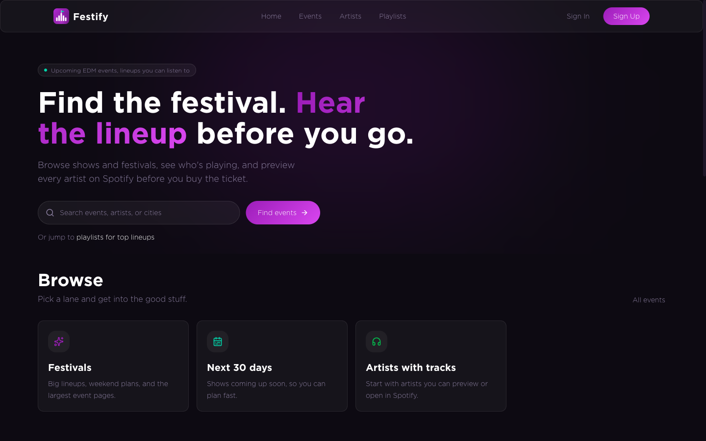
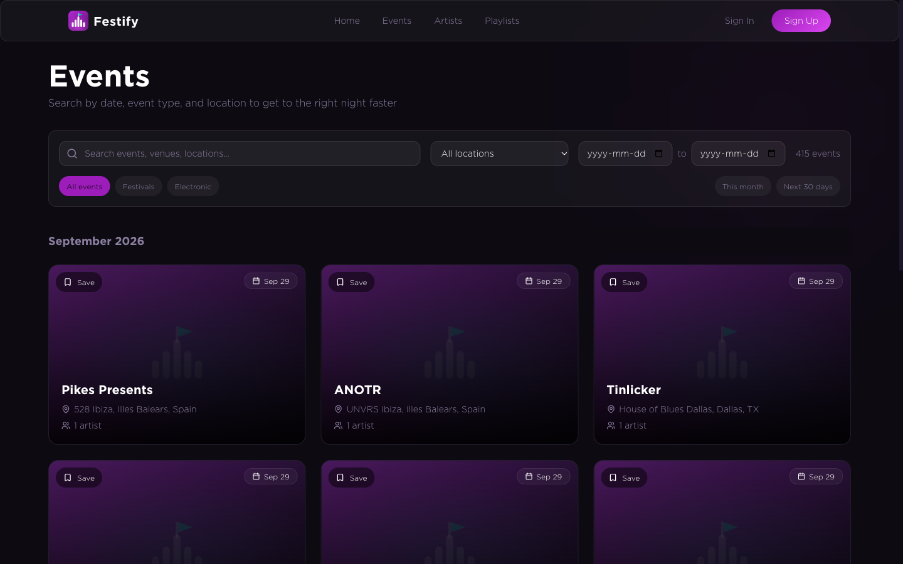
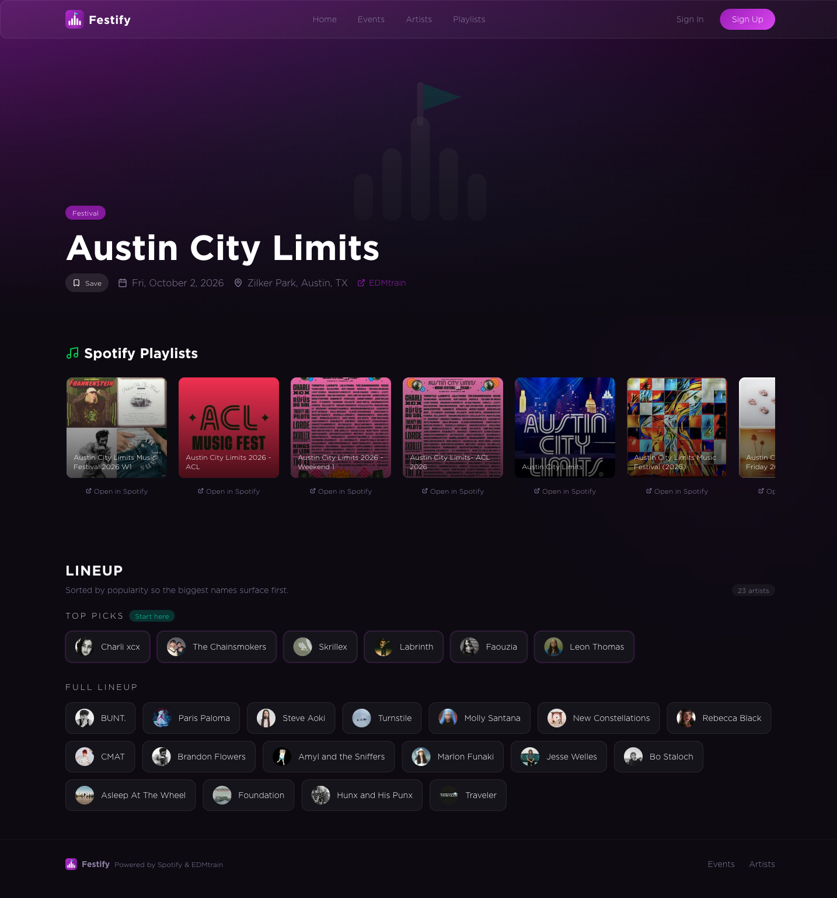
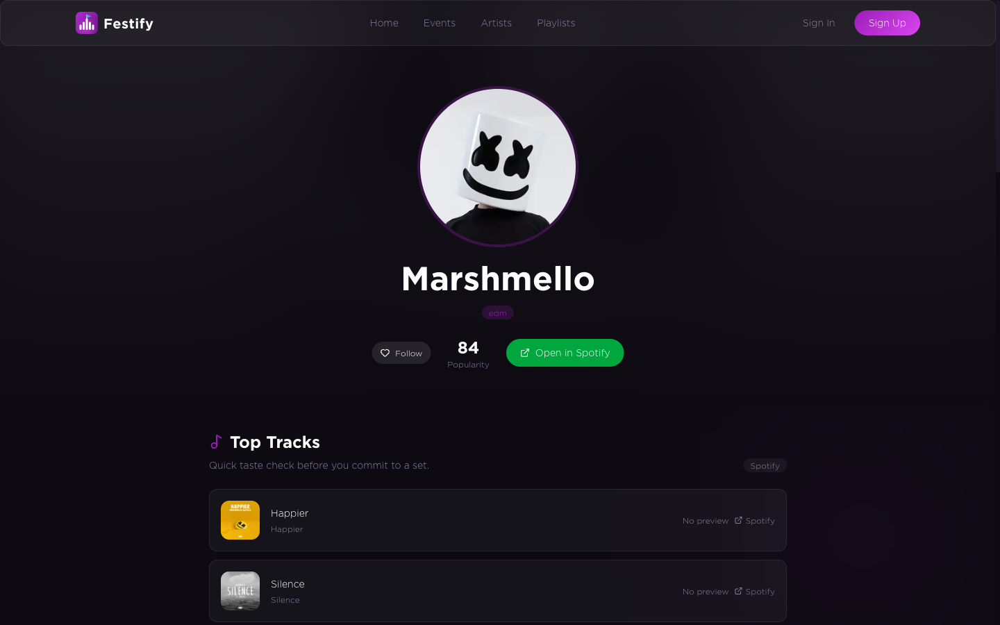
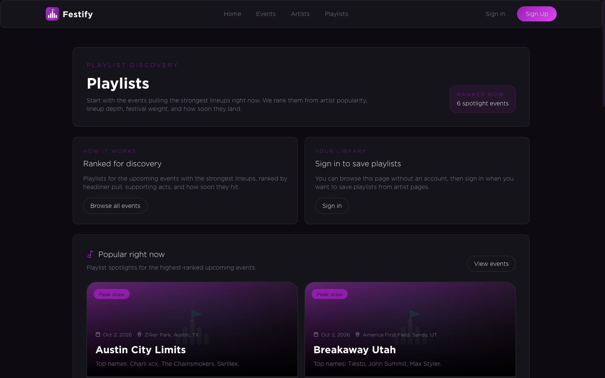
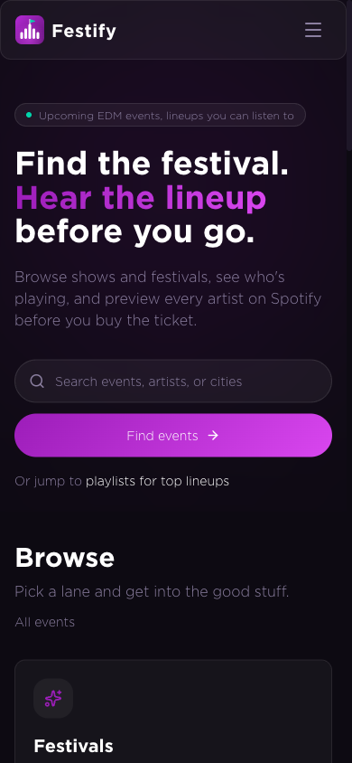

<div align="center">


# Festify

**Find the festival. Hear the lineup before you go.**

Festify is an EDM event companion. Browse upcoming shows and festivals, see who's
playing, and preview every artist on Spotify before you buy the ticket.

[Features](#features) •
[Screenshots](#screenshots) •
[Getting started](#getting-started) •
[Architecture](#architecture) •
[Project structure](#project-structure)

</div>



## Features

- **Event discovery.** Every upcoming EDM show and festival from EDMTrain and Resident
  Advisor. Filter by date, city, and type, or search by event, venue, city, or artist.
  Multi-day festivals stay listed until their last day.
- **Lineups you can listen to.** Event pages show the full lineup, ordered by artist
  popularity. Each one opens into Spotify playlists for the event.
- **Artist pages.** Top tracks with in-page previews, related playlists, and upcoming
  shows for every artist.
- **Playlist discovery.** `/playlists` ranks upcoming events by lineup strength
  (headliner pull, supporting acts, lineup depth, festival bonus, and how soon they
  are) and surfaces playlists for the best ones.
- **Your taste, no account needed.** Follow artists, save events, and pick genres.
  The home page then recommends shows, including later dates for artists you follow.
  Taste is stored on your device.
- **Accounts + Spotify.** Sign in to keep a saved-playlist library. Connect Spotify
  and saves also follow the playlist in your Spotify account.

## Screenshots

| Home | Events |
| --- | --- |
|  |  |

| Event lineup | Artist |
| --- | --- |
|  |  |

| Playlists | Mobile |
| --- | --- |
|  |  |

## Getting started

### Prerequisites

- Node.js 20+ (developed on 22)
- A [Supabase](https://supabase.com) project
- A [Spotify developer app](https://developer.spotify.com/dashboard) (client id + secret)
- An [EDMTrain API key](https://edmtrain.com/api-documentation) for syncing events

### 1. Install

```bash
git clone git@github.com:yobazy/festify-2.0.git
cd festify-2.0
(cd festify && npm install)
(cd server && npm install)
```

### 2. Configure environment

```bash
cp festify/env.example festify/.env.local
cp server/.env.example server/.env
```

| Variable | Used by | Purpose |
| --- | --- | --- |
| `NEXT_PUBLIC_SUPABASE_URL`, `NEXT_PUBLIC_SUPABASE_ANON_KEY` | web | Supabase client (browser + server components) |
| `SUPABASE_URL`, `SUPABASE_SERVICE_KEY` | web, sync | Service-role access: Spotify token storage, event sync writes |
| `SPOTIFY_CLIENT_ID`, `SPOTIFY_CLIENT_SECRET` | web, sync | Spotify search, top tracks, account connect, artist image backfill |
| `EDMTRAIN_API_KEY` | sync | EDMTrain event feed |
| `RA_AREA_IDS` | sync | Optional Resident Advisor area ids |
| `NEXT_PUBLIC_SITE_URL` | web | Canonical URL for auth redirects, the Spotify OAuth callback, and share cards |

In your Spotify app settings, add `<NEXT_PUBLIC_SITE_URL>/api/spotify/callback` as a
redirect URI. In Supabase Auth, add `<NEXT_PUBLIC_SITE_URL>/auth/callback`.

### 3. Set up the database

Apply the SQL in [`supabase/migrations/`](supabase/migrations) to your project, in
order. Use the Supabase CLI (`supabase db push`) or paste each file into the SQL
editor. The core `events`, `artists`, and `gigs` tables are filled by the sync script.

### 4. Sync events

```bash
cd server
npm run sync            # pull EDMTrain + Resident Advisor events, artists, and gigs
npm run sync:artists    # backfill missing artist images from Spotify
```

Run `npm run sync` on a schedule (cron, GitHub Actions, etc.) to keep listings fresh.

### 5. Run the app

```bash
cd festify
npm run dev             # http://localhost:3000
```

Other scripts: `npm run build`, `npm start`, and `npm run lint`.

## Architecture

```
EDMTrain / Resident Advisor ──> server/scripts/sync-events.js ──> Supabase (events, artists, gigs)
                                                                        │
Spotify Web API <── festify/src/app/api/spotify/* (app token stays on the server)
                                                                        │
                                  Next.js App Router (server components) ──> browser
```

- **Next.js 16 App Router** with React 19 server components. Pages query Supabase on
  the server. Interactive pieces (filters, taste, Spotify previews) are client
  components.
- **Supabase** stores events, artists, and gigs (the event–artist join), plus auth,
  the saved-playlist library (`user_saved_playlists`), and Spotify OAuth tokens
  (`user_spotify_tokens`, service-role only). `src/proxy.ts` refreshes the auth
  session on each request.
- **Spotify.** Browser code never sees a Spotify token. Playlist search and top tracks
  go through `/api/spotify/search` and `/api/spotify/top-tracks`, which use a cached
  client-credentials token and CDN caching. Account connect uses the Authorization
  Code flow.
- **Taste** (followed artists, saved events, genres) lives in a persisted Zustand
  store on the device. `/api/events/for-artists` looks up future shows for the artists
  you follow.
- **Dates.** Events are calendar days. Always use the helpers in `src/lib/dates.ts`:
  "today" is Pacific time, and an event counts as upcoming until its last day.

### Tech stack

Next.js 16 · React 19 · TypeScript · Tailwind CSS 4 · Framer Motion · Zustand ·
Supabase (Postgres + Auth) · Spotify Web API · EDMTrain API

## Project structure

```
festify-2.0/
├── festify/                  # Next.js web app
│   ├── public/images/        # logo.svg (brand mark), placeholders
│   └── src/
│       ├── app/              # routes: /, /events, /artists, /playlists, /settings, /auth, /api
│       ├── components/       # brand/, home/, events/, event-detail/, artists/, artist-detail/, layout/, ui/
│       ├── lib/              # dates, event queries, redirect guard, Spotify (client + server), Supabase clients
│       ├── stores/           # tasteStore (persisted Zustand)
│       └── proxy.ts          # Supabase session refresh
├── server/scripts/           # sync-events.js: EDMTrain + RA → Supabase
├── supabase/migrations/      # SQL migrations
└── screenshots/              # README images
```

## Brand

The Festify mark is a row of equalizer bars that rises into a festival main-stage
peak, with a teal "live" pennant on the center pole. The full mark is
[`festify/public/images/logo.svg`](festify/public/images/logo.svg), and
`festify/src/app/icon.svg` is a simplified 3-bar version for favicons. In the app, use
`<Logo />` or `<LogoMark />` from `src/components/brand/Logo.tsx`. Colors come from the
`--brand-*`, `--primary`, and `--accent` tokens in `src/app/globals.css`.

## Background

Festify 2.0 is a rewrite of a project that started at a web development bootcamp. The
original lives at [yobazy/festify](https://github.com/yobazy/festify).
